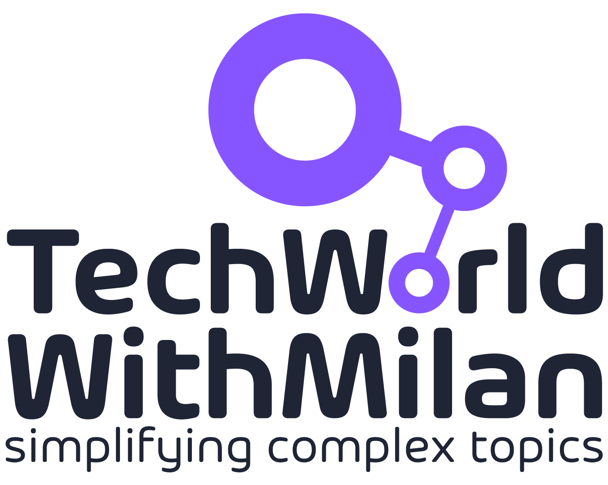

### Hi there, I'm Milan 👋

🎯 I'm working as a startup **CTO**. I have over 20 years of professional experience in different domains, including the finance industry, banking, energy sector, transportation, insurance, and telco in different roles, from software engineer to architect and consultant. I'm also a **Microsoft MVP for Developer Technologies**.

🚀 My mission is to provide **engineering excellence** focused on proper architecture and the best agile practices, **passionately build high-performing teams** and organizations to deliver innovative, high-quality products, working closely with customers and developing software products on different platforms.

🎓 As a **researcher**, I published 20+ papers and book chapters in international conferences and journals (with more than 440+ citations and an [h-index of 11 on Google Scholar](https://scholar.google.com/citations?user=9DlmJqcAAAAJ)). I obtained a **Ph.D. in Computer Sciences**. 

✍🏻 Additionally, I am an author who helps more than **300,000 engineers, managers, and architects** to build great careers, products, and teams through various platforms and channels.

## 👉 Subscribe to my [Newsletter]([https://techwithmarko.com](https://newsletter.techworld-with-milan.com/)), where I write on different aspects of Software Engineering for more than 44K people. 

💬 Ask me about Software Architecture, Cloud computing (Azure), C#/.NET, Databases, DevOps, Agile methods, People, Coaching, Organizations, Productivity. 

📫 How to reach me:

* E-mail: [contact](https://milan.milanovic.org/#contact)
* LinkedIn: [milanmilanovic](https://www.linkedin.com/in/milanmilanovic/)
* Twitter: [@milan_milanovic](https://twitter.com/milan_milanovic)
* Substack: [@techworldwithmilan](https://substack.com/@techworldwithmilan)
* BSky: [milanmilanovic](https://bsky.app/profile/milanmilanovic.bsky.social)
