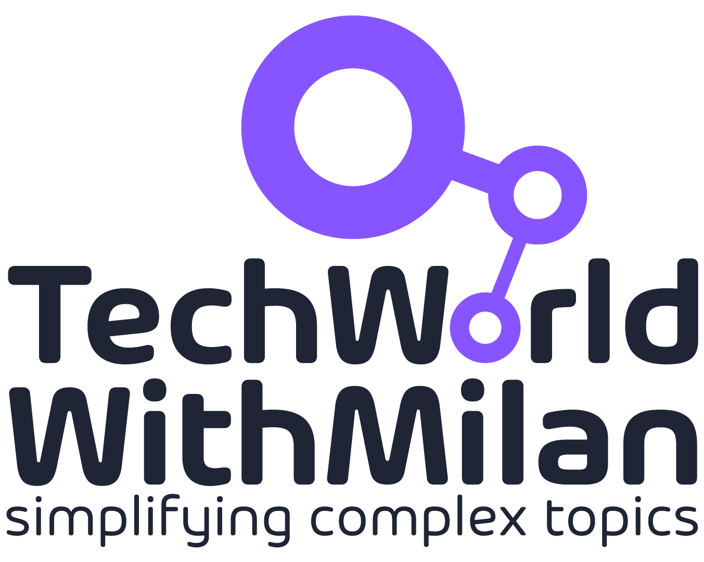

### Hi, I'm Milan 👋

I'm a CTO and the author of **[Laws of Software Engineering](https://lawsofsoftwareengineering.com)**. Over 20+ years, I've built software and engineering teams across finance, banking, energy, transportation, insurance, and telco, in roles from engineer to architect to CTO. I'm a **[Microsoft MVP for Developer Technologies](https://mvp.microsoft.com/en-US/MVP/profile/af364500-1e9e-ed11-83ff-000d3a5600fa)** and hold a Ph.D. in Computer Science, with 20+ published papers and [440+ citations](https://scholar.google.com/citations?user=9DlmJqcAAAAJ).

Today I help 400K+ engineers and leaders grow through better software, teams, and careers.

### 📖 My book: Laws of Software Engineering

A 300-page guide to 63+ laws and principles that shape software systems, teams, and decisions, from Conway's Law and Brooks's Law to CAP and Goodhart's Law. Forewords by Dr. Rebecca Parsons (CTO Emerita, Thoughtworks) and Addy Osmani (Google).

**[Get the book »](https://lawsofsoftwareengineering.com)**

### ✉️ Newsletter

I write weekly on software engineering, architecture, and leadership.

**[Subscribe to Tech World With Milan »](https://newsletter.techworld-with-milan.com/)**

### 💬 Ask me about

Software architecture, Azure, C#/.NET, databases, DevOps, engineering management, coaching, and careers.

### 📫 Where to find me

- [LinkedIn](https://www.linkedin.com/in/milanmilanovic/)
- [X](https://twitter.com/milan_milanovic)
- [Substack](https://substack.com/@techworldwithmilan)
- [Bluesky](https://bsky.app/profile/milanmilanovic.bsky.social)
- [Website](https://milan.milanovic.org)
